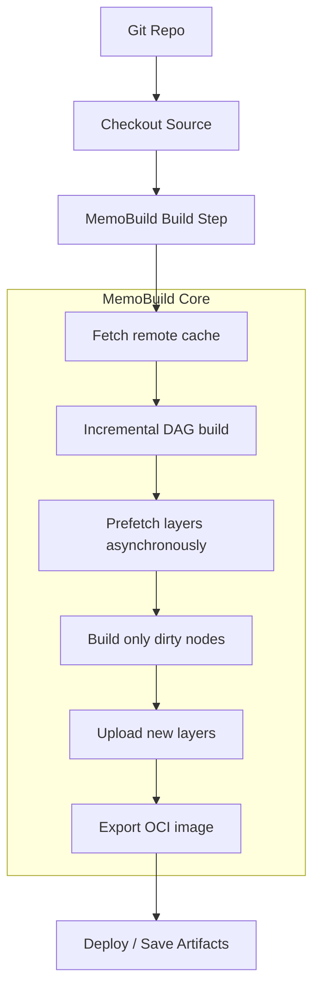

# 🌐 MemoBuild CI/CD Integration Blueprint

## 1️⃣ Objectives
- **Maximize incremental build speed** by leveraging remote cache.
- **Reuse build artifacts** across branches and runners.
- **Produce reproducible, deterministic OCI images** for deployment.
- **Enable visibility** into build DAG and cache efficiency during CI runs.

## 2️⃣ Common Architecture



### Key Components:
- **Remote Cache Server URL**: `MEMOBUILD_REMOTE_URL`
- **Node-level DAG & metrics**: Optional upload to dashboard or logs.
- **OCI output**: Saved as pipeline artifact or deployed.

## 3️⃣ GitHub Actions Example

```yaml
name: MemoBuild CI

on:
  push:
    branches: [main, develop]
  pull_request:
    branches: [main]

env:
  MEMOBUILD_REMOTE_URL: https://cache.example.com
  MEMOBUILD_OUTPUT: .memobuild-output

jobs:
  build:
    runs-on: ubuntu-latest
    steps:
      - uses: actions/checkout@v3

      # Install Rust
      - name: Install Rust
        uses: actions-rs/toolchain@v1
        with:
          toolchain: stable
          override: true

      # Build with MemoBuild
      - name: Run MemoBuild
        run: cargo run --release -- build

      # Upload OCI image artifact
      - name: Upload OCI Artifact
        uses: actions/upload-artifact@v3
        with:
          name: memobuild-oci-image
          path: ${{ env.MEMOBUILD_OUTPUT }}/memobuild-demo-latest
```

**Notes:**
- MemoBuild automatically uses remote cache.
- Incremental builds reuse layers from previous pipeline runs.
- OCI output can be deployed or stored as artifact.

## 4️⃣ GitLab CI Example

```yaml
stages:
  - build
  - deploy

variables:
  MEMOBUILD_REMOTE_URL: https://cache.example.com
  MEMOBUILD_OUTPUT: .memobuild-output

build_container:
  stage: build
  image: rust:latest
  script:
    - cargo run --release -- build
  artifacts:
    paths:
      - $MEMOBUILD_OUTPUT/memobuild-demo-latest
    expire_in: 1 week

deploy_container:
  stage: deploy
  script:
    - echo "Deploying OCI image..."
    - # Custom deployment commands using OCI image
```

**Notes:**
- Artifacts retain OCI image for later stages or deployment.
- Remote cache ensures minimal rebuilds even on different runners.

## 5️⃣ Cloud Runner Integration (Generic)
Supports AWS CodeBuild, Google Cloud Build, Azure Pipelines, Jenkins, etc.

### Env Setup:
- `MEMOBUILD_REMOTE_URL`: Point to your remote cache server.
- `MEMOBUILD_OUTPUT`: Output path for OCI image.

### Workflow:
1. Checkout repo.
2. Install Rust / MemoBuild binary.
3. Run MemoBuild with `cargo run -- build`.
4. Upload OCI output as artifact or deploy directly.

**Benefits:** all runners share remote cache; incremental rebuilds are consistent across environments.

## 6️⃣ Best Practices
- **Secure Remote Cache**: Remote Cache URL should be secured via HTTPS and auth tokens.
- **Prefetch Layers**: Run background prefetch to reduce DAG node wait times.
- **Parallelization**: Incremental DAG Execution – mark independent nodes as parallelizable for maximum throughput.
- **Persistent Cache**: Keep cache storage in persistent volumes or cloud storage for CI runners.
- **Metrics Export**: Optionally push DAG execution & cache stats to MemoBuild dashboard for visibility.

## 7️⃣ Example Workflow with Remote Cache Optimization

```bash
# Pull cached layers first
export MEMOBUILD_REMOTE_URL=https://cache.example.com
cargo run --release -- build
```

### Result:
- **Cold build (first run)**: fetches all available layers, rebuilds missing ones.
- **Warm build (subsequent runs)**: rebuilds only dirty nodes → seconds.
- **Cross-runner builds**: reuse identical layers → network & compute savings.

## 8️⃣ Outcome
- Fully incremental, distributed CI/CD builds.
- Shared remote cache ensures reproducible artifacts across pipelines.
- OCI image ready for deployment or container registries.
- Metrics + DAG observability provides actionable feedback for optimization.
