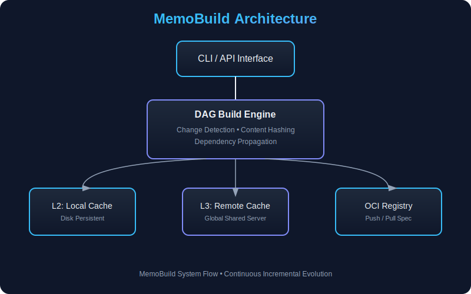

# 🧠 MemoBuild Engine

[](https://github.com/nrelab/MemoBuild/actions/workflows/ci.yml)
[](https://opensource.org/licenses/MIT)
[](https://www.rust-lang.org)

**High-Performance Incremental Build System with Smart Caching**

MemoBuild is a next-generation build system that intelligently rebuilds only what's changed, using advanced dependency tracking, multi-layer caching, and OCI-compatible image generation.

**[🚀 Read the Vision](./docs/VISION.md)** | **[📄 Technical Whitepaper](./docs/WHITEPAPER.md)** | **[💻 CLI Manual](./docs/CLI_REFERENCE.md)** | **[🌐 CI/CD Integration](./CI_CD_INTEGRATION.md)**

---

## 🏗️ Architecture Overview



MemoBuild transforms container builds from **linear execution → dependency graph execution**.

---

## 🚀 Quick Start

### 1. Installation

```bash
# Clone the repository
git clone https://github.com/nrelab/MemoBuild.git
cd memobuild

# Build and install locally
cargo install --path .
```

### 2. Basic Usage

```bash
# Build current directory
memobuild build .

# Visualize the build graph
memobuild graph

# Explain why a node was or wasn't cached
memobuild explain-cache

# Build and push to registry
export MEMOBUILD_REGISTRY=ghcr.io
export MEMOBUILD_REPO=myuser/app
export MEMOBUILD_TOKEN=$(gh auth token)
memobuild build --push .
```

### 3. Remote Cache Sharing (Optional)

```bash
# Start the Remote Cache Server
memobuild server --port 8080 --storage ./cache-data

# Client: Share artifacts across the team
export MEMOBUILD_REMOTE_URL=http://localhost:8080
memobuild build .
```

---

## 📂 Examples

Visit the [examples/](./examples) directory to see ready-to-use projects:
- **[Node.js App](./examples/nodejs-app)**: Simple web server with dependency caching.
- **[Rust App](./examples/rust-app)**: High-performance async app showing complex build caching.

---

## 📋 Documentation Reference

- **[Vision](./docs/VISION.md)**: The philosophy and problem statement.
- **[Whitepaper](./docs/WHITEPAPER.md)**: Deep technical spec and mathematical foundations.
- **[CLI Reference](./docs/CLI_REFERENCE.md)**: Detailed command and option manual.
- **[Architecture Diagram](./docs/ARCHITECTURE.svg)**: Visual process flow.
- **[CI/CD Integration](./CI_CD_INTEGRATION.md)**: Blueprint for GitHub Actions, GitLab, and cloud runners.

---

## ✨ Features

- **BLAKE3 Hashing**: Ultra-fast content hashing for change detection.
- **Tiered Smart Cache**: Multi-layer (In-memory, Local, Remote) sharing.
- **DAG Execution**: Parallelized rebuild of affected subgraphs only.
- **OCI Compliance**: Push directly to any standard container registry.
- **K8s Helper**: Generate native Kubernetes Job manifests for cloud builds.

---

## 📋 Core Components

### 1. **Change Detector** (`src/core.rs`)
- BLAKE3-based file hashing
- Directory tree hashing
- Dependency-aware hash computation
- Dirty flag propagation

### 2. **Graph Builder** (`src/graph.rs`)
- Dockerfile → DAG conversion
- Node types: Source, Build, Artifact, Dependency
- Topological sorting
- Dependency management

### 3. **Hybrid Cache System** (`src/cache.rs`)
- Tiered caching (L1 In-memory, L2 Local, L3 Remote)
- Content-addressed artifact storage (CAS)
- Gzip compression for artifacts

### 4. **OCI Image Exporter** (`src/oci/mod.rs`)
- OCI-compliant manifest and config generation
- Layer digest calculation
- Registry push/pull using Distribution Spec

---

## 🧪 Testing

```bash
# Run all tests
cargo test

# Run with verbose output
cargo test -- --nocapture

# Run specific test
cargo test test_end_to_end_build_with_remote_cache
```

---

## 🤝 Contributing

Contributions are welcome! Please feel free to submit a Pull Request.

## 📄 License

MIT License - see [LICENSE](./LICENSE) file for details

---

**MemoBuild** - Smart builds, faster deployments 🚀
