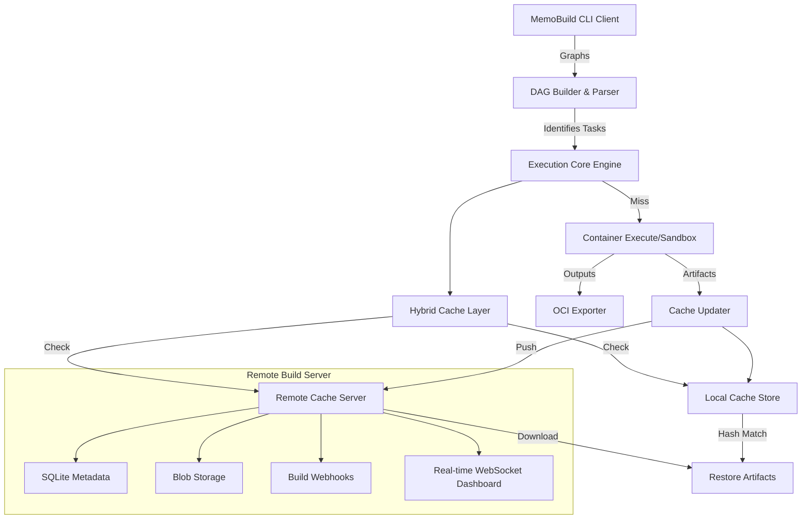

# MemoBuild Architecture

MemoBuild is designed as a highly scalable, incremental build system. It utilizes a DAG (Directed Acyclic Graph) for build execution, leverages efficient caching layered on BLAKE3 hashing, and offers remote execution capabilities.

## Architecture Diagram

## Core Principles

1. **DAG-Based Execution**: Every build process is analyzed into a sequential and parallel task graph ensuring the fastest reproducible path.
2. **Hybrid Caching**: By first checking a high-speed local storage system and falling back to a shared artifact remote server, it preserves bandwidth while speeding up concurrent CI builds.
3. **Data Integrity (CAS)**: All artifacts are indexed by the BLAKE3 hash of their inputs. It guarantees strict deterministic tracking preventing cache poisoning.
4. **OCI Native**: Builds are naturally exported as strict OCI-compliant container environments making deployment transitions seamless.

## Component Interactions

- `src/core.rs`: Coordinates change-detection, file reading, and state.
- `src/docker/`: Analyzes standard Dockerfiles, producing nodes for the MemoBuild graph.
- `src/hasher/`: Traverses workspaces avoiding `.dockerignore` patterns, executing parallelized BLAKE3 hashing.
- `src/executor.rs`: Manages task runner states, dispatching parallel units.
- `src/remote_cache.rs`: Client facade bridging the HTTP APIs to our Remote Server.
- `src/server/mod.rs`: Server runtime employing `axum` and `tokio` for handling remote sync requests.
